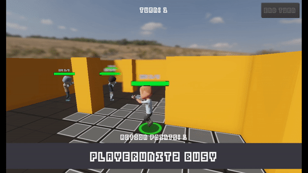
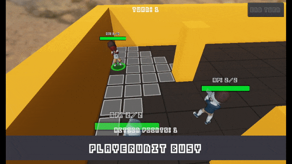
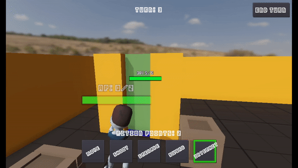

# TurnBasedStrategyGodot
A turn-based strategy game in godot (3.5), based on the Code Monkey's Turn Based Strategy course that can be found here: https://unitycodemonkey.com/courses.php?c=turnbasedstrategy

## Why?

Why not? ;)

The course is great and the principles are general enough that they apply regardless of engine (but I also like godot!). And it's a great reference project for future ideas; a turn-based dungeon game with blackjack and... stuff.

## Features

- Turns!
- Shooting.
- Grenades.
- State machines.
- Pathfinding via navigation.
- Zombies (with guns!).
- Ragdolls.
- Crates!
- Melee attacks.
- Doors.
- Enemy AI.
- Camera controls and movement.
- Custom resources.
- Bugs!
 

Features freebie assets from kenney: https://kenney.nl/assets and Synty: https://syntystore.com/.

## Controls

Running the game, use WASD to move the camera around, Q and E to rotate. + and - move up and down. Select a unit, move them around and shoot zombies.

## TODO:

- Generic IInteractable featured in the course as a proof of concept.
- Final level design; tidy up the level and make it playable, game over and win conditions (not featured in the course).
- Polish - things like highlighting units with remaining action points, navigating units and so on.

## Differences from the course:

- The course heavily relies on the Singleton pattern: https://en.wikipedia.org/wiki/Singleton_pattern. Here, less so (only the EventBus is a singleton).
- Properties rather than methods.
- Node-based state machine for actions - the course defines these in code, essentially duplicating the data in the tree.
- Raycasts - a few remain for line of sight although mostly unnecessary in godot: https://docs.godotengine.org/en/stable/tutorials/physics/ray-casting.html#d-ray-casting-from-screen (tl;dr - colliders report mouse clicks).
