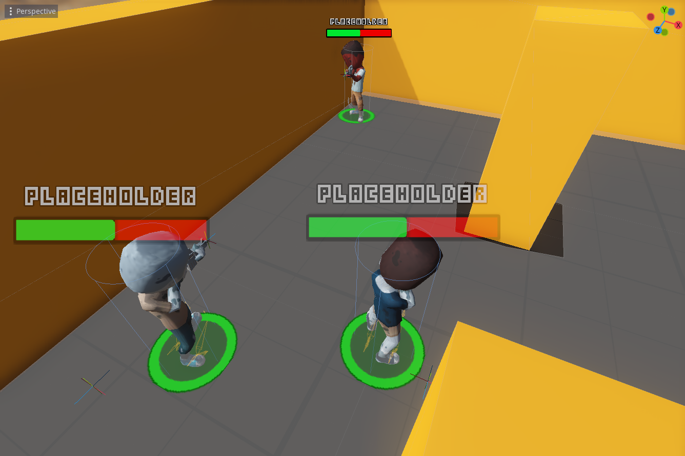

# TurnBasedStrategyGodot
A turn-based strategy game in godot (3.5), based on the Code Monkey's Turn Based Strategy course that can be found here: https://unitycodemonkey.com/courses.php?c=turnbasedstrategy

## Why?

Why not? ;)

The course is great and the principles are general enough that they apply regardless of engine (but I also like godot!). And it's a great reference project for future ideas; a turn-based dungeon game with blackjack and... stuff.

## Features

- Turns!
- Shooting.
- State machines.
- Pathfinding via navigation.
- Zombies (with guns!).
- Ragdolls.
- Enemy AI.
- Camera controls and movement.
- Bugs!

Features freebie assets from kenney: https://kenney.nl/assets and Synty: https://syntystore.com/.

## Controls

Running the game, use WASD to move the camera around, Q and E to rotate. + and - (keypad) move up and down. Select a unit, move them around and shoot zombies.

## TODO:

- Finish the course (around 25% to go, added polish).
